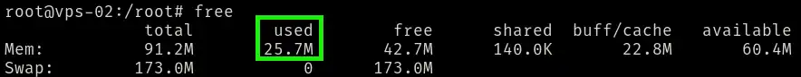

# tierhive-scripts

[Tierhive](https://tierhive.com/) offers VPS instances starting at 128MB RAM and 1GB disk. This repo is for setting up and maintaining their Alpine Linux image with a small footprint and predictable configuration.

## quick start

- Clone the repository.

```bash
git clone https://github.com/austinp0573/tierhive-lab.git
```

- `cd` into the directory.

```bash
cd tierhive-lab
```

- Compress the scripts/ directory in preparation for transport.

```bash
tar -cvf - scripts/ | xz > scripts.tar.xz
```

- Transfer the scripts to the vps.

```bash
scp -i ~/.ssh/your_private_key -P your_port scripts.tar.xz root@ip:/root/
```

- Logged in as root on your VPS:
  - Decompress the scripts.
  - Dispose of them.
  - Move into the `scripts/` directory.
  - Run the entry-point.

```sh
tar -xvf scripts.tar.xz
rm scripts.tar.xz
cd scripts/
./setup.sh
```

Note: After you run the scripts and restart, when you log back in you will need to run:

```bash
ssh-keygen -R host_or_IP
```

- The `dropbear` key will be different than the SSH key you initially used to SSH in.

## customization

- As stated below, the scripts in the `core/` directory will all run in numbered order.
- If you don't want to run any of them, just move it out of that directory.
  - If you'd like to add your own. Just number it according the the order you'd like it to run, and put it in the `core/` directory.
- After all of `core/` has run, it will prompt individually for all of the scripts in `optional/`.

## the purpose

Alpine is lean, very lean, but it can be leaner without negatively impacting the user.

Before the scripts the idle ram is `~40MB`.

After the scripts:



In addition to the RAM savings:
- `swap` is enabled (On 128MB RAM, I usually go with 128MB, but that's up to the user)
  - (This happens first because you can't `apk update` with 128MB of RAM)
- `zram` is enabled (I usually go with RAM/2, but it's up to the user)
- The system is minimalized.
  - And some nice to have packages are added.
    - `dropbear` becomes the SSH server, because it works just as good, and relatively a lot less RAM.
    - I specifically always add the speedtest-go binary
- System user aliases and other creature comforts are added.
- Nonroot user is setup. (with `doas`, there is no `sudo`)
- SSH is "hardened"


- From the `optional/` I pretty much always do the very skinny alpine version of `unattended-upgrades` as well.

### Containers?

Containers are great.
Unfortunately the `docker daemon` costs `~100MB` which means that's definitely out on a system with `128` (`93` usable) MB of RAM.

Podman (in this case rootful) can be run without a daemon at a cost of `~2MB` - `~5MB` of RAM per container.

The `podmanv2.sh` sets this up quite nicely.
- `cgroups` are enabled so you can control container resources.
  - (very important on a VPS with 128MB of RAM and a 1GB Disk)
- auto-restart for applicable containers is also included.
- (I got it working with "docker compose" type functionality, but that's more trouble than it's worth)

The `alpine-nginx` container running only got the system up to `~29MB` of RAM use.

I was able to run `adguard-home` with less than `55MB`.
- Full disclosure: That required a custom scratch image, and some tuning, but it worked beautifully.


## usage

For the shell scripts, run `setup.sh` first on a fresh VPS. It runs the numbered scripts in `scripts/core/` in order, then offers anything in `scripts/optional/`. Individual scripts can still be run standalone. `run-scripts.sh` walks through optional setup scripts, and `run-diagnostics.sh` walks through diagnostic checks.

For Ansible, start in `ansible/`. The current playbook provisions WireGuard on Alpine Linux with nftables-based peer access controls. See `ansible/README.md` for the inventory layout and WireGuard variables.

## scripts

The shell setup is split into a small entry point, numbered core scripts, and optional extras. Core scripts run in filename order, so the early memory steps stay predictable:

```text
scripts/core/
  00-swap.sh
  10-apk-update.sh
  20-zram.sh
  30-minimal-dropbear.sh
  40-base-packages.sh
  50-speedtest-go.sh
  60-profile.sh
  70-user-doas.sh
  80-ssh-hardening.sh
```

Dropbear is the default because this repo is tuned for very small VPSs. The OpenSSH minimal path is still available through `scripts/alternates/minimal-openssh.sh` if you want that tradeoff instead.

| script | what it does |
|---|---|
| `setup.sh` | main setup — run this first on a fresh VPS |
| `alpine-minimal.sh` | strips the system down: removes cloud-init, python, unused kernel modules, replaces chrony with busybox ntpd, tunes sysctl for low RAM |
| `alpine-minimal-dropbear.sh` | same as above but swaps OpenSSH for Dropbear |
| `setup-swap.sh` | creates a swapfile, prompts for size |
| `setup-zram.sh` | sets up compressed swap in RAM, prompts for size and algorithm |
| `profile-alias.sh` | configures `/etc/profile.d/` with aliases, an ash-compatible prompt, and a fastfetch welcome on login |
| `non-doas-setup.sh` | creates a non-root user, adds them to wheel, configures doas, optionally copies SSH keys |
| `unattended-upgrades-setup-alpine.sh` | daily auto-upgrade via crond, writes a reboot alert to motd when kernel/musl/openssl updates |
| `speedtest-go-setup.sh` | installs speedtest-go |
| `ipv6_and_net_optimization.sh` | network sysctl tuning scaled to available RAM, optional static IPv6 setup |
| `set-hostname.sh` | renames the system hostname cleanly |
| `run-scripts.sh` | walks through optional scripts and asks if you want to run them |
| `run-diagnostics.sh` | walks through diagnostic scripts and asks if you want to run them |

## ansible

The Ansible work is the direction this repo is moving. The goal is to keep server configuration idempotent, modular, and safe to rerun. For now, the Ansible scope is intentionally narrow: WireGuard server setup on Alpine Linux, including package setup, forwarding, nftables rules, and peer access controls.

The base scripts still exist because they are convenient and because not everything has been moved yet. If you plan to manage a host with Ansible, do not remove Python from that host (at present the minimal scripts remove python).

## notes

- everything here is Alpine Linux only. don't run these on anything else.
- these reflect my personal setup preferences. read them before you run them.
- shell scripts must be run as root.
- real inventories, keys, and host-specific values should stay out of git.
- The original shell scripts still work and are useful for one-off setup. I am moving the repeatable server configuration over to Ansible playbooks, starting with WireGuard, so the same repo can handle both a fresh VPS and later updates without redoing everything by hand.

---

&nbsp;

**466f724a616e6574**
